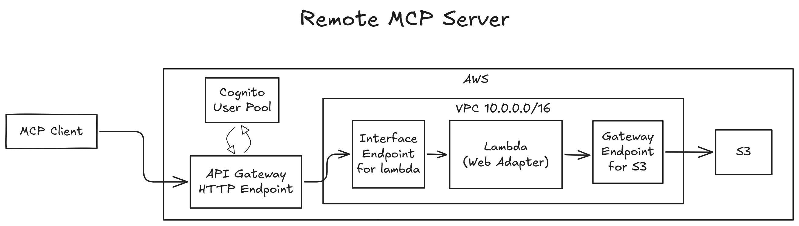

# secured-remote-mcp-server-on-aws

認証付きのAPI Gateway (HTTP) をエントリポイントとし、VPC内に配置されたプライベートなLambdaを経由してS3にアクセスすることで、安全にMCP Serverを公開するソリューションです</br>
</br>
本リポジトリでは、S3のファイルリストを返す簡易的な例を示していますが、Lambdaに様々なリソースにアクセスするMCP Serverを実装することで多様な用途に対応できます</br>
</br>
※TerraformやMCPのキャッチアップを念頭にしながら、プロダクションデプロイ可能なユースケースを想定し、ポートフォリオとして開発しています



## ディレクトリ構成

```bash

├── /.devcontainer
├── /.vscode
│   ├── mcp.json                        # GitHub Copilot Agentモードで使用する際の設定
│   └── settings.json                   # DevContainer内のVSCode設定
├── /.github
│   ├── /workflows                      
│   └── copilot-instructions.md         # GitHub Copilotのカスタム指示 
├── /terraform
│   ├── /env                 # 環境ごとの設定
│   │   ├── /dev             # dev環境向け
│   │   └── /prod            # prod環境向け
│   └── /modules             # 再利用可能モジュール定義
│       ├── /vpc             
│       ├── /lambda
│       └── ...
├── /sam                     # aws sam cli版 (未)
├── /src                     # mcp serverのソースコード
├── /src                     # mcp serverのソースコード
└── README.md                # このファイル
```

## 使用方法

MCP Clientからの利用</br>
例: vscode拡張機能のGithub Copilot Agentの設定例(mcp.json)

``` mcp.json
{
    "servers": {
        "aws-private-lambda-for-mcp": {
            "type": "http",
            "url":  "https://{apiエンドポイント名}.execute-api.ap-northeast-1.amazonaws.com/mcp/",
            "headers": {
                "Authorization": "Bearer eyJraWQiOiJJ.....",
                "Accept": "application/json, text/event-stream"
            }
        }
    }
}
```

## デプロイ

前提条件:

1. devcontainer実行環境
1. GitHubアカウント連携が済んでいるHCP Terraform アカウント
1. AWSアカウントと紐づいたIAM Identity Centerユーザー

.env作成:

```bash
cp .env.sample .env
cp .auto.tfvars.sample .auto.tfvars
```

HCP Terraform bootstrap:

1. 「TFE_TOKEN」は「<https://app.terraform.io/app/settings/tokens>」で発行
1. 「TFE_ORGANIZATION」は「<https://app.terraform.io/app/organizations/new>」で作成

```bash
# devcontainerに入る
# bootstrap.tfを元に「dev-secured-remote-mcp-server-on-aws」と「prod-secured-remote-mcp-server-on-aws」が作成される
terraform init
terraform plan
terraform apply
```
